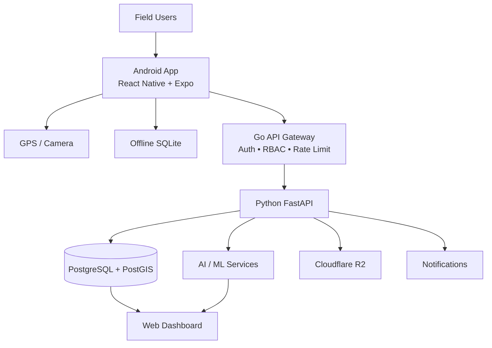

# SIH 26024 — Android Application

Field operations application for coal mine inspections, compliance monitoring,
incident reporting, and geo-tagged field data collection.

## Tech Stack

- React Native + Expo
- Expo Location — GPS 
- Expo Camera — Photos / Media
- SQLite — Offline Storage
- Go API Gateway
- Python + FastAPI — Backend / AI Integration

## Architecture

## Core Features

- Geo-tagged inspections
- Safety and incident reporting
- Photo and media capture
- Offline-first field operations
- Compliance data collection
- Secure API integration
- AI-assisted risk analysis

## Data Flow

Field User → Android App → Go API Gateway → FastAPI → Database / AI → Web Dashboard

## SIH 2026

Problem Statement: 26024 — AI-Based Smart Governance and Compliance Monitoring System for Coal Mine
